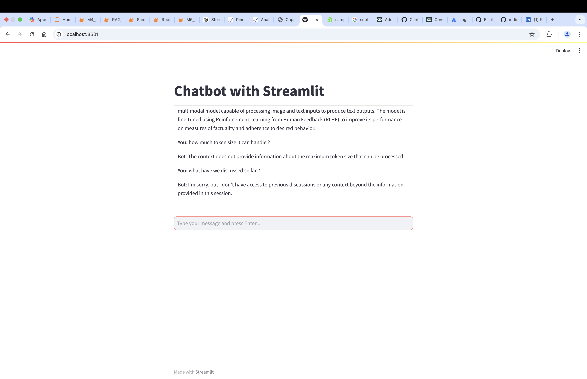
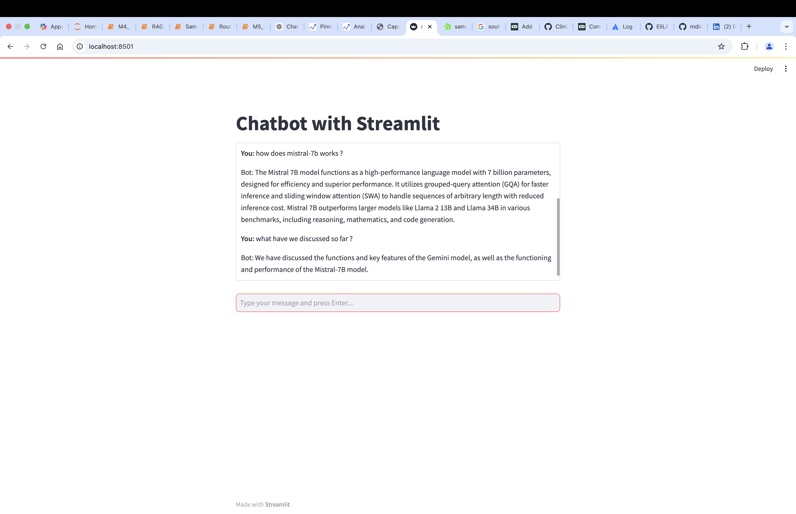

# Corrective_Agent_project
# This is a simple multi agentic RAG bot based on Gen AI research Paper with converstational context as well.
# 
# - **Vector Database:** ChromaDB
# - **Chunking Strategy:** Standarda character splitting chunking .
#   - A corrective agent can be implemented which evealuate the chunk result and rwrite the query.
# - **Document Parsing:** Uses a Text Loader for parsing the document, as it's in Markdown (.md) format.
# - **LLM:** OpenAI (GPT-4.0 model)
# - **Streamlit:** A streamlit application has been done.

